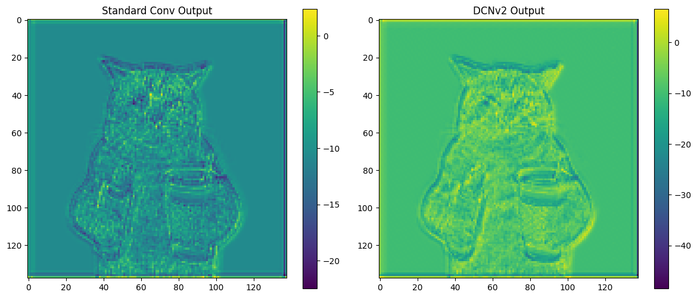

# DCNv2 for CUDA 12.8 & PyTorch 2.8.0

This repository provides an updated build of **Deformable Convolutional Networks v2 (DCNv2)** compatible with **CUDA 12.8** and **PyTorch 2.8.0**. It is intended for developers and researchers working with modern deep learning frameworks who need deformable convolution support in custom pipelines. The build has been tested on CUDA 12.8 with a Pytorch 2.8.0 version, the retro-compatibility hasn't been tested yet.

## 🔧 Features

- Compatible with PyTorch 2.8.0
- Built for CUDA 12.8
- Tested on Linux/Windows with Python 3.10+
- Plug-and-play integration with YOLACT++, MMDetection, and custom models

## 📦 Build

```bash
git clone https://github.com/yourusername/dcnv2-modern.git
cd DCNV2-CUDA12.8
python setup.py build_ext --inplace
```

## ✍️ Test

Here are the results using the YOLACT+ model weight through the DCNv2 compared to a standard Convolution Model :

</img>

## 📚 Notes

- The repository has been updated for CUDA use case only, CPU functionality has not been maintained and is currently non-functional.

- You will encounter an error on the testcuda.py, the error is mainly caused by the gradcheck function which cannot output a coherent tensor using the given inputs. However, the analytical tensor produced by the DCNv2 kernel remains valid and can be used to fine-tune your network.

> [!IMPORTANT]  
> The compiled file will be saved under the name **_ext.cp{PYTHON VERSION}-{ARCHITECTURE}.pyd**. The dcn_v2.py file search for _ext, make sure to rename it properly.

## 📄 Citation & Credits

This work is based on the original [DCNv2 implementation by Charles Shang](https://github.com/CharlesShang/DCNv2), and its subsequent forks. All credit for the original algorithm and code structure goes to the authors of:

> **Deformable ConvNets v2: More Deformable, Better Results**  
> Xizhou Zhu, Han Hu, Stephen Lin, Jifeng Dai  
> [arXiv:1811.11168](https://arxiv.org/abs/1811.11168)


This repository modifies the build system and adapts the code for compatibility with newer CUDA and PyTorch versions. It retains the original BSD 3-Clause License.